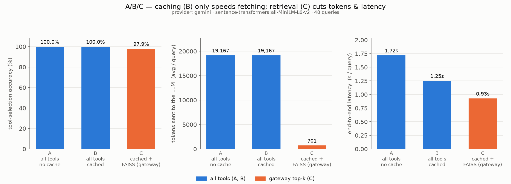
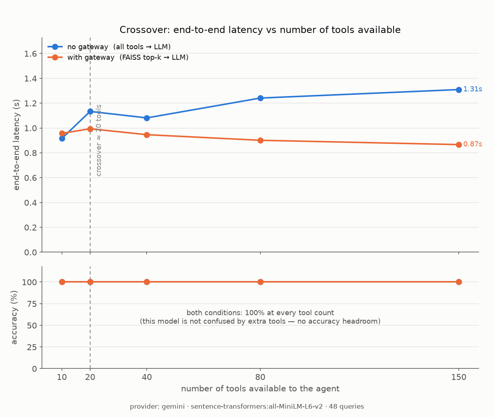

<!-- Rendered to README.md by benchmark/update_readme.py from the last run's numbers.
     Edit README.template.md, not README.md. -->
# mcp-gateway

**A retrieval-and-policy layer between an AI agent and many MCP (Model Context
Protocol) servers.** When an agent can reach 100+ tools, dumping them all into
the prompt wastes tokens and (with a weaker model) picks the wrong tool. This
gateway uses FAISS semantic retrieval to hand the LLM only the top-k relevant
tools per query, wraps a policy plane around it (allow/deny, tool-poisoning
detection, prompt-injection scanning, SQLite audit), and ships a benchmark that
measures — with real numbers — whether it was worth it.






## The problem, and why caching isn't the answer

Pasting every tool schema into the prompt burns thousands of tokens per call and,
with a weaker model or overlapping tools, makes the model pick the wrong one.
Teams reach for a **cache** first — but caching only makes the tool list arrive
*faster*; the model still sees all 100 tools. What changes the model's job is
**semantic retrieval**: embed every tool once, then per query hand the LLM only
the top-k (default 5) tools that look relevant. The cache and the retriever solve
*different* problems and compose — this repo measures exactly how much each one
buys you.

**Headline from the measured run (real LLM via gemini):**

- Caching made tool fetching **48× faster** and left accuracy
  unchanged (0.0 pp) — it's a speed fix, not an accuracy fix.
- Retrieval sent the LLM **27× fewer tokens** (19167 → 701)
  and cut end-to-end latency **26%** (1.25s → 0.93s) for a
  59 ms retrieval step. Accuracy went 100.0% → 97.9%: this model
  was already at the ceiling on the full list, so there was no confusion for
  retrieval to remove (see "Why Claim 2 came back partial" below).
- The latency lines **cross at 20 tools**. Below that the gateway
  isn't worth the extra step; above it the gap widens every call.

---

## The three claims — and what the run actually showed

| # | Claim | Verdict |
|---|-------|---------|
| 1 | Caching speeds up tool **fetching** but does **not** improve tool-selection accuracy | ✅ holds |
| 2 | FAISS retrieval improves **accuracy** AND cuts **tokens** AND lowers **end-to-end latency**, despite adding a retrieval step | 🟡 partial |
| 3 | There is a **crossover** (~20–40 tools): below it the gateway isn't worth it, above it it clearly wins | ✅ holds |

### Measured results (A / B / C)

```
   setup                                 acc  tools   tokens  fetch ms  retr ms   llm s   e2e s
------------------------------------------------------------------------------
A  All tools, no cache                100.0%    157    19167    503.87     0.00   1.215   1.719
B  All tools, cached                  100.0%    157    19167     10.52     0.00   1.240   1.250
C  Cached + FAISS retrieval (gateway)  97.9%      5      701     10.51    59.05   0.856   0.926
```

### Measured results (crossover)

```
 tools | acc no-gw  acc gw |  lat no-gw   lat gw | tok no-gw   tok gw
------------------------------------------------------------------------------
    10 |    100.0%  100.0% |      0.915    0.957 |      1304      686
    20 |    100.0%  100.0% |      1.133    0.994 |      2518      696
    40 |    100.0%  100.0% |      1.081    0.946 |      4972      695
    80 |    100.0%  100.0% |      1.241    0.901 |      9777      685
   150 |    100.0%  100.0% |      1.309    0.866 |     18328      672
```

### Verdicts, verbatim from the run

```
[PASS] Claim 1 - caching speeds fetching, not accuracy:
        fetch 503.87ms -> 10.52ms (48x faster), accuracy 100.0% -> 100.0% (delta 0.0pp, within noise).
[PARTIAL] Claim 2 - FAISS retrieval improves accuracy AND cuts tokens AND lowers latency:
        accuracy 100.0% -> 97.9% (NOT up), tokens 19167 -> 701 (down), e2e latency 1.250s -> 0.926s (down); retrieval step adds only 59.1ms.
[PASS] Claim 3 - crossover point sits around 20-40 tools:
        measured crossover = 20
        @10 tools: gw does not help (lat 0.915s -> 0.957s, acc 100% -> 100%)
        @80 tools: gw clearly wins (lat 1.241s -> 0.901s, acc 100% -> 100%)
```

_Run metadata: provider=gemini · simulated=False · catalogue={'curated': 27, 'synthetic': 130} · real_mcp_live=27 · embedder=sentence-transformers:all-MiniLM-L6-v2 · backend=faiss.IndexFlatIP · queries=48 · audit_rows={'rows': 144, 'flagged': 0} · ts=2026-08-31T16:02:27Z_

### Why Claim 2 came back partial (intellectual honesty)

Claim 2 has three parts. **Tokens** and **latency** held decisively: retrieval
sent **27× fewer tokens** (19167 → 701) and cut end-to-end
latency **26%** (1.25s → 0.93s), for a 59 ms
retrieval step.

The **accuracy** part didn't — because there was nothing to fix. On this clean,
well-separated 157-tool catalogue, `gemini` picked the correct tool
**100.0% of the time with the entire list in context** (and 100% at every
crossover tool-count). A model that is already at the ceiling can't be made more
accurate by showing it fewer options. The gateway's `C` run came in at
97.9% — a single query whose target ranked 6th in FAISS and fell just outside
the top-5.

Where the accuracy half of Claim 2 *does* show up: a weaker/cheaper model, or a
catalogue with genuinely ambiguous near-duplicate tools (five "create ticket"-ish
tools). Swap `EMBED_MODEL`/`GEMINI_MODEL` down and the gap opens. What this run
proves cleanly is the part that's true regardless of model strength: **retrieval
makes a big tool catalogue cheap to use.**

---

## Caching vs Retrieval — they solve different problems

| | **Cache** (`gateway/cache.py`) | **Retrieval** (`gateway/retriever.py`) |
|---|---|---|
| Problem it solves | Re-fetching tool schemas from slow/remote MCP servers every turn | Sending the LLM a huge, mostly-irrelevant tool list every turn |
| What it changes | *Fetch latency* ↓ (here 48×) | *Tokens* ↓ (27×), *latency* ↓ (26%), *model confusion* ↓ (when the model isn't already at ceiling) |
| What it does **not** change | The set of tools the model sees → **accuracy unchanged** | It still has to fetch the catalogue once (that's what the cache is for) |
| Cost it adds | ~0 (dict lookup + TTL check) | one query embedding + a FAISS search + hybrid re-rank (59 ms here) |

They compose: the gateway (setup **C**) is *cache **then** retrieve*. The cache
makes the catalogue cheap to have; retrieval makes it cheap to *use*.

## When NOT to use this

- **Under ~20 tools.** The crossover experiment shows the retrieval
  step's overhead (embedding + index search + a second failure mode) isn't repaid
  when the full tool list is already small. Just send all the tools.
- **When your tools are already disjoint and few.** Retrieval earns its keep when
  tools are numerous and semantically overlapping. If you have 8 tools that do
  obviously different things, a capable model won't be confused and you're adding
  latency for nothing — which is exactly what the sub-crossover rows show.
- **Ultra-low-latency single-tool paths.** If the agent almost always calls one
  known tool, skip the gateway for that path.
- The gateway is worth it exactly when tool sprawl is real (dozens+ of tools) —
  where the token and latency savings (proven here) compound every call, and the
  accuracy savings kick in as soon as the model or the tool set gets harder.

---

## Architecture

```
                ┌───────────────────────── gateway/proxy.py ─────────────────────────┐
 user query ───▶│  cache.py            retriever.py             policy.py            │──▶ small, vetted
                │  ┌─────────┐  full   ┌──────────────┐  top-k  ┌──────────────────┐  │    tool set for
 MCP servers ──▶│  │ TTLCache│ ───────▶│ FAISS + MiniLM│ ──────▶│ allow/deny        │  │    the LLM
 (real +        │  │ + timing│  cat.   │ + hybrid rank │        │ desc-hash / rugpull│ │
  curated +     │  └─────────┘         └──────────────┘        │ injection scan     │  │
  synthetic)    │                                              │ SQLite audit log   │  │
                │                                              └──────────────────┘  │
                └────────────────────────────────────────────────────────────────────┘
                                         │
                                         ▼
                          gateway/llm.py  (Groq ▸ Gemini ▸ simulated)
```

| Module | Responsibility |
|---|---|
| `gateway/tools.py` | Tool model + 3 sources: **real** MCP servers (filesystem + "everything", live over stdio), **curated** realistic schemas (the benchmark's ground truth, always present), **synthetic** generator (~130 enterprise distractor tools across billing/devops/HR/analytics/…). |
| `gateway/mcp_client.py` | ~150-line dependency-free MCP **stdio** client — `initialize` handshake + `tools/list`. |
| `gateway/cache.py` | In-memory **TTL cache** with hit/miss + cold-fetch timing. Measurable by design. |
| `gateway/retriever.py` | Embed `name + description` of every tool into a **FAISS** `IndexFlatIP` at startup; per query embed the question, take a wide semantic shortlist (`pool=30`) and **re-rank it hybrid** (`alpha·semantic + (1−alpha)·lexical`, `alpha=0.6`), return top-k. Embedder is pluggable (`SentenceTransformerEmbedder` default = free/local `all-MiniLM-L6-v2`; `HashingEmbedder` zero-dep fallback). |
| `gateway/policy.py` | Allowlist/denylist; **SHA-256 description hashing** to catch silent "rug pull" description swaps; regex **prompt-injection** scan of descriptions; **SQLite audit log** of every call (ts, query, tools retrieved, tool chosen, flagged?). |
| `gateway/proxy.py` | Wires cache → retriever → policy into one `prepare(query)` call returning the filtered tool set **and** the measurements. |
| `gateway/llm.py` | Swappable tool-selection provider via one config value: **Groq** (preferred) ▸ **Gemini** (fallback) ▸ **simulated** (offline, deterministic, clearly labelled). Model auto-falls-back within a provider if one is retired. Keys only from env / `.env`. |
| `benchmark/` | `queries.json` (48 labelled questions), `run_benchmark.py` (setups A/B/C + crossover sweep), `make_charts.py` (the 2 PNGs), `update_readme.py`. Raw output as JSON + CSV in `benchmark/results/`. |

**Real vs simulated tools:** the runner connects to the real filesystem +
"everything" MCP servers over stdio and prints the split, e.g.
`real_mcp_live=27  catalogue={'curated': 27, 'synthetic': 130}`. Real tools are
**verified every run** but kept out of the *scored* catalogue by default (they
expose names like `read_file` that collide with the curated ground-truth
`fs.read_file` and would blur accuracy); `--with-real` mixes them in. `curated`
and `synthetic` are clearly-labelled local schemas. If npx / the network is
unavailable the run continues with curated + synthetic only and says so.

---

## How to run

```bash
# 1. Python 3.11+ virtualenv  (this repo was built/tested on 3.14)
python3 -m venv .venv && source .venv/bin/activate
pip install -r requirements.txt

# 2. One API key (never hard-coded — read from env or .env)
cp .env.example .env
#   put GROQ_API_KEY=... in .env   (free: https://console.groq.com/keys)
#   or: export GROQ_API_KEY=...
#   Gemini fallback: GEMINI_API_KEY=...
#   No key? run offline:  export MCP_GATEWAY_PROVIDER=simulated

# 3. Run the whole benchmark + regenerate charts + README
python benchmark/run_benchmark.py

# extras
python benchmark/run_benchmark.py --provider simulated     # offline pipeline
python benchmark/run_benchmark.py --quick                   # 8-query smoke test
python benchmark/run_benchmark.py --with-real               # mix live MCP tools into the scored set
LLM_PACE_SECONDS=3 python benchmark/run_benchmark.py        # pace calls under a free-tier RPM cap
python demo.py "page the on-call, checkout is down" --llm   # single-query trace
python scripts/security_demo.py                             # rug-pull + injection demo
python tests/test_gateway.py                                # offline unit checks
```

If no key is present the runner prints exactly which env var to set and exits.

## Using this as a library

Install straight from GitHub — no PyPI publish, no local clone needed:

```bash
pip install git+https://github.com/harshchinmalliofficial/MCP-Gateway-Tool-Retrieval-Policy-Layer-for-Multi-Server-Agents.git
```

```python
from gateway.proxy import build_default_proxy

proxy = build_default_proxy(allow_network=False)  # skip live MCP server discovery
print([t.name for t in proxy.prepare("reboot EC2 instance i-0abc123").tools])
```

`gateway/__init__.py` also re-exports `GatewayProxy`, `FaissRetriever` and
`load_catalogue` (an alias for `gateway.tools.build_catalog`) for direct
`from gateway import ...` access. Note that `config.py` resolves its data
paths relative to its own file, so once installed as a dependency the
`data/` and `benchmark/results/` folders it creates land inside your
environment's `site-packages/`, not your project directory — fine for
quick usage, but override `config.DATA_DIR` / `config.AUDIT_DB_PATH` (or
set `MCP_GATEWAY_PROVIDER` / API keys via real env vars rather than a
`.env` file) if you need those written somewhere else.

### Config knobs (all in `config.py`, env-overridable)

| Value | Default | Meaning |
|---|---|---|
| `LLM_PROVIDER` / `MCP_GATEWAY_PROVIDER` | `auto` | `groq` \| `gemini` \| `auto` \| `simulated` |
| `RETRIEVAL_TOP_K` | `5` | tools returned per query |
| `EMBED_MODEL` | `all-MiniLM-L6-v2` | any sentence-transformers model |
| `RETRIEVAL_POOL` / `RETRIEVAL_ALPHA` | `30` / `0.6` | hybrid re-rank: shortlist size; weight on semantic vs lexical (`1.0` = pure vector) |
| `CACHE_TTL_SECONDS` | `300` | tool-catalogue cache TTL |
| `SIMULATED_FETCH_LATENCY_MS` | `20` | per-server cold-fetch delay so cache vs no-cache is visible |
| `LLM_PACE_SECONDS` | `0` | fixed pause after each LLM call (free-tier RPM relief) |
| `SYNTHETIC_TOOL_COUNT` | `130` | distractor tools generated |
| `CROSSOVER_TOOL_COUNTS` | `10,20,40,80,150` | crossover sweep points |

---

## Notes / honesty

- **Provider used for the numbers above: `gemini`.** Groq is the configured
  *preferred* provider and works for the gateway path, but its **free tier caps a
  single request at 8 000 tokens** — and setups A/B send the whole ~19 k-token
  catalogue, which Groq free-tier rejects with a 413. (That rejection is itself a
  data point for the thesis.) For a clean apples-to-apples table the benchmark
  falls back to Gemini, exactly as the `auto` / Groq→Gemini fallback is designed
  to. Set a paid Groq key (or `GROQ_MODEL` to a small-context model) and
  `--provider groq` to run it there.
- **Accuracy needs a real LLM.** With `--provider simulated` the tool-selection
  step is a deterministic lexical matcher, not a model — those accuracy numbers
  are labelled `SIMULATED` everywhere. Fetch-time, token and latency mechanics
  are real regardless of provider.
- **Simulated fetch latency.** Cold catalogue fetches add a small per-server
  sleep (`SIMULATED_FETCH_LATENCY_MS`, default 20 ms) so the cache-vs-no-cache
  delta is visible without depending on a flaky remote host. Real MCP servers,
  when reachable, also contribute their real handshake time.
- **The crossover sweep disables simulated fetch latency** so that chart isolates
  the effect that matters there: the LLM processing a big vs a small tool list.
- **Free-tier pacing.** The headline run used `LLM_PACE_SECONDS=3` to stay under
  Gemini's requests-per-minute cap; it inflates wall-clock time but not the
  per-call `llm s` / `e2e s` figures, which are measured around the API call only.
